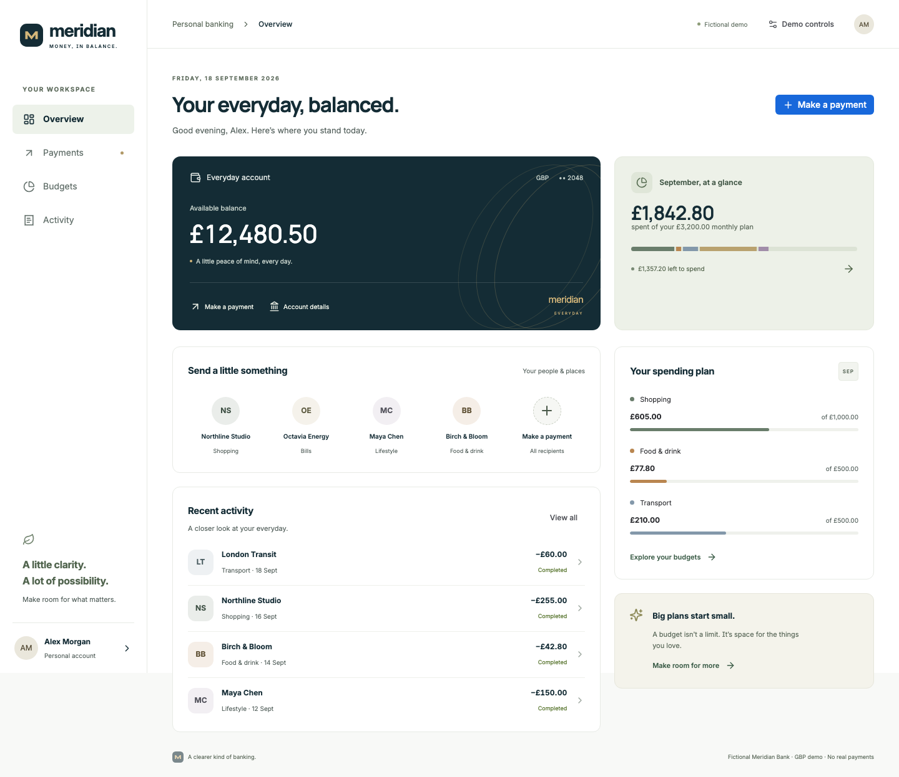

# Meridian Money

A customer-facing banking and payments demo, built with React, TypeScript and **Atlassian Design System (Atlaskit)**. Meridian Bank, its customers, teams and transactions are fictional.



## Run it

```sh
npm ci
npm run dev
# http://127.0.0.1:5175
```

Node 22.12+ is required. No API keys, backend or login needed.

## Interactive features

- Overview with available balance, monthly spending, quick recipients and recent activity.
- Payment flow: saved recipient, GBP amount, reference, payment method, review, confirmation and receipt.
- Current provider registry: **Adyen** for the card simulation, **Worldpay** for the bank-payment simulation. This routing is demo-specific, not a claim about product capabilities.
- Successful payments debit the demo balance once and update activity and category spending.
- Budget editing with validation, searchable/filterable activity and browser-local persistence.
- Rehearsal controls: success, decline and unavailable scenarios, plus confirmed reset.
- Responsive layout, keyboard navigation, semantic form controls and reduced-motion support.

The next provider integration is deliberately absent. There is no provider installation UI, hidden feature flag or pre-built third-provider code. The repository is a baseline for a later planner-driven payment-screen change.

## Scope and safety

This is a **local simulation**, not a banking service. It never collects financial credentials, calls provider APIs or moves money. The saved debit card and bank account are masked fictional fixtures. Don't enter personal data in the reference field: it is stored locally, without encryption. The fixed demo date is **18 September 2026**, and currency is GBP only. Reload restores state from this browser; separate tabs don't synchronize live.

Frontend validation and idempotency are not server-side security. No real authentication, authorization, SCA, PCI certification, webhook handling, settlement or bank reconciliation is implemented. The policy and architecture docs describe proposed requirements, not compliance evidence.

## Project layout

```
src/App.tsx                 Screens and interaction state
src/components/Dialog.tsx   Native focus-trapping dialog with ADS controls
src/domain/model.ts         Integer-pence money, validation, provider registry, simulation
src/domain/storage.ts       Validated, versioned local storage and recovery
src/styles.css              Meridian brand surfaces and responsive layouts
src/main.tsx                Official ADS reset and theme initialization
src/domain/*.test.ts        Domain and persistence tests
tests/e2e/banking.spec.ts    Browser journeys
```

Shared controls use official `@atlaskit/button`, `textfield`, `lozenge` and `section-message`, with ADS tokens and CSS reset. Custom bank cards, navigation, recipient selectors and charts retain Meridian branding. Native dialog avoids the React 19 incompatibility found in the previous prototype's ADS modal dependency. Lucide supplies decorative icons. See [design system notes](docs/brand-design-system.md).

## Verify

```sh
npm run check
npx playwright install chromium
npm run test:e2e
TEST_PRODUCTION=1 npm run test:e2e
```

GitHub Actions runs static checks, unit tests and production browser tests. Build output is `dist/`, with relative asset URLs for a static host. No live deployment is configured.

## Context for the planner

Start with [the documentation index](docs/README.md) and [demo runbook](docs/demo-runbook.md). Company strategy, provider evaluation, compliance policies, integration standards, brand guidance and illustrative team/Jira context are included as linked Markdown seeds. They have **not** been published to Confluence or Jira. `meridian-api` (Java/Spring Boot) and `meridian-mobile` (Swift/Kotlin) are contextual target repositories, not additional applications built here.
